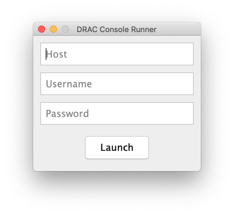

# drac-runner

## Overview

`drac-runner` is a simple launcher for Dell's iDRAC 6 remote management console. No more messing with buggy login pages, JNLP files, and manually-edited security settings! Simply enter the hostname you wish to connect to and your credentials, and you're ready to go.

To use it, you'll need `avctKVM.jar`, which you can download from your iDRAC. See the instructions in the `lib` directory for information on adding the JAR file to the project.

Compatibility reports from iDRAC 7 and 8 users are welcome!

## TODO

- support custom launch parameters - I think iDRAC 7 might require slightly different launch options
- use `JarClassLoader` to optionally load the avctKVM.jar at runtime instead of having it as a compile time dependency. that way I can distribute this project as a precompiled JAR
- support native keyboard helper library (almost everything works without it)

